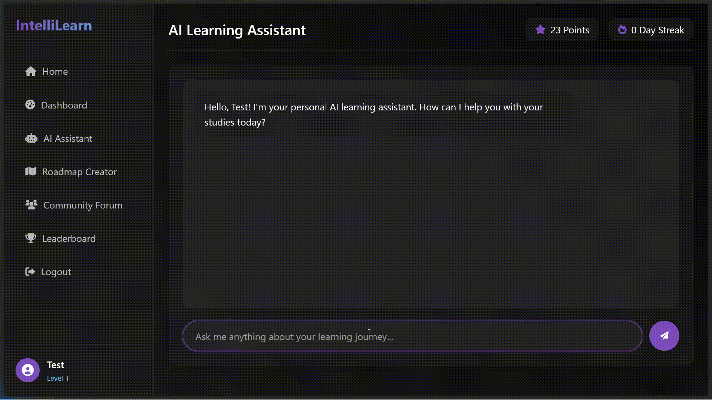

# Learning Roadmap Platform

A personalized learning platform with AI-powered roadmaps, interactive forums, and gamified learning experiences.

## Features

- **AI-Powered Learning Assistant**: Chat with an AI assistant that knows your learning progress
- **Custom Learning Roadmaps**: Generate personalized learning paths for any topic
- **Interactive Forums**: Engage with other learners in community discussions
- **Gamification**: Earn points, level up, and maintain streaks as you learn
- **Quizzes**: Test your knowledge with AI-generated quizzes
- **Leaderboards**: Track your progress against other learners

 **Showcase:**
 - Home Page:

- Dashboard:

- Chatbot:


## Technical Overview

This application is built with:

- **Backend**: Flask (Python)
- **Frontend**: HTML, CSS, JavaScript
- **Database**: JSON file-based storage
- **AI Integration**: Ollama API with LLama 3.2 model

## Prerequisites

- Python 3.8+
- [Ollama](https://ollama.ai/) with the LLama 3.2 model installed
- Ollama server running on port 11434

## Installation

1. Clone the repository:
   ```
   git clone https://github.com/WanderingHumanid/IntelliLearn.git
   cd learning-roadmap-platform
   ```

2. Create and activate a virtual environment (optional but recommended):
   ```
   python -m venv venv
   source venv/bin/activate  # On Windows: venv\Scripts\activate
   ```

3. Install dependencies:
   ```
   pip install -r requirements.txt
   ```

4. Make sure Ollama is running with the LLama 3.2 model:
   ```
   ollama run llama3.2
   ```

## Running the Application

1. Start the Flask server:
   ```
   python app.py
   ```

2. Open your browser and navigate to:
   ```
   http://localhost:5000
   ```

## Application Structure

```
learning-roadmap-platform/
├── app.py               # Main Flask application
├── requirements.txt     # Python dependencies
├── data/                # Database storage
│   └── db.json          # JSON database file
├── static/              # Static assets
│   ├── css/             # Stylesheets
│   └── js/              # JavaScript files
└── templates/           # HTML templates
    ├── base.html        # Base template
    ├── index.html       # Landing page
    ├── login.html       # Login page
    ├── signup.html      # Signup page
    ├── dashboard.html   # User dashboard
    ├── ai_chat.html     # AI assistant chat interface
    ├── forum.html       # Community forum
    ├── leaderboard.html # User rankings
    ├── roadmap_creator.html # Roadmap creation tool
    └── roadmap_view.html   # Roadmap view page
```

## Data Storage

The application uses a simple JSON file-based storage system located in `data/db.json`. The database contains:

- User accounts and profiles
- Learning roadmaps
- Forum posts and comments

## Future Enhancements

- User profile customization
- Advanced analytics and progress tracking
- Document/Image processing through Tesseract/OCR.
- More accessibility options in the Forum section
- Mobile application support
- Proper database implementation (PostgreSQL/MongoDB)
- OAuth authentication